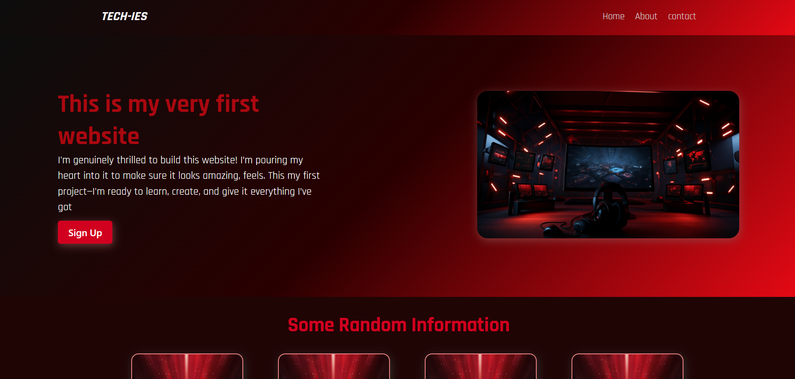

# Odin-landing-page

This is a landing page built as part of my web development journey. It features modern HTML and CSS techniques including flexbox layout, gradients, and optimized styling for clean presentation.

## Features
- Flexbox-based layout
- Smooth background gradients
- Semantic HTML structure
- Custom styling for responsive design

## Preview

Live Site: [Visit the Landing Page]([https://obaid123.github.io/landing-page-project](https://obaid-qazi.github.io/Odin-landing-page/))

## Technologies Used
- HTML5
- CSS3

## About the Project

This landing page was created as part of my journey into web development, inspired by the Odin Project curriculum. The main goal was to build a visually appealing and responsive design using clean HTML and CSS layout techniques.

All color combinations in this project were chosen with the support of Microsoft Copilot, who helped generate modern, balanced gradients that enhance clarity, mood, and accessibility. I focused on implementing and refining these styles to create a clean and engaging visual experience.

While building this project, I improved my understanding of:
- Flexbox layout strategies
- Creating aesthetic gradients and background images
- Structuring semantic HTML for better accessibility
- Presenting a polished design that works across screen sizes

This marks my first complete project push to GitHub, and I'm excited to share it as the beginning of a portfolio that blends strong technical foundations with clean design.

## Author

Created by **Obaid** – an aspiring developer exploring web technologies, accessibility, and design optimization with a deep focus on community and presentation.

## Acknowledgements

Thanks to [The Odin Project](https://www.theodinproject.com/) for the learning resources and to Microsoft Copilot for guidance on styling and color inspiration throughout the project.